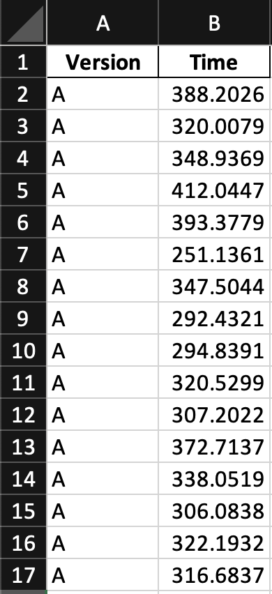
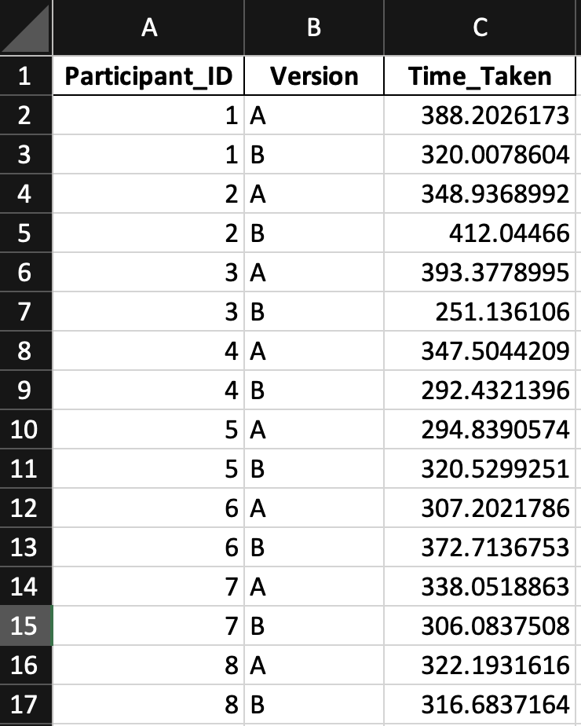

```{r setup, include=FALSE}
knitr::opts_chunk$set(echo = TRUE)
library(tidyverse)
library(tinytex)
# tinytex::install_tinytex(force = TRUE)
# install.packages("readxl")
?rmarkdown::pandoc_available
```
### Quantitative Data

In conducting your controlled usability study, you may have collected quantitative data, such as the time taken to complete a task. This guide will show you how to analyze quantitative data using R.

Note that the statistical tests done below assume that the data is parametric. That is, the data meets the following three criteria:

* **Independence**: each subject is sampled independently of every other subject, and measures from one subject are
independent of measures on any other subject.
* **Normality**: data is normally distributed (technically, the error terms are normally distributed).
* **Homoskedasticity**: the variance is similar across all levels of factors.

If your data is not normally distributed (e.g., likert scale data), you should use non-parametric tests instead.

> **BEFORE YOU BEGIN**\
> This guide uses R to read the data from an Excel file, generate plots, summary statistics, and conduct the analysis. Please install an IDE that supports R programming, such as [RStudio](https://posit.co/downloads/) or [PyCharm](https://www.jetbrains.com/pycharm/) with the [R plugin](https://plugins.jetbrains.com/plugin/6632-r-language-for-intellij).

### Step 1: Preparing Data

At this point, you should have a set of quantitative data for each participant.

The responses should be stored in an Excel file, with each row representing a respondent. Each dependent variable gets its own column, though how the design prototype is incorporated is dependent on whether you ran a between or within-subjects design experiment.

> **Experimental Design**\
> * If you ran a **between-subjects** design, you only need a column for the prototype version.\
> * If you ran a **within-subjects** design, you should have one column for the prototype version and another column for a user's identifier (e.g., participant ID).\
> \
> In either case, the remainder of your columns should correspond to each dependent variable that you measured.

This is an example of what your Excel file should look like for a **between-subjects** design:



And for a **within-subjects** design:



### Step 2: Loading Data into R

Now that you have your data in an Excel file, you can load it into R. The easiest way to do this is to use the `read_excel()` function from the `readxl` package.

If you haven't installed the package yet, be sure to uncomment the `install.packages()` line in the code chunk below.

```{r read, echo=TRUE}
# install.packages("readxl")
library(readxl)

# Read the Excel file
time_data <- read_excel("../data/usability_study_quantitative_data_bs.xlsx")
```

### Step 3: Creating Plots

It may be useful to create plots to show the distribution of the completion time by version. You can use the `ggplot2` package to create plots.

**Boxplot**:
```{r boxplot, echo=TRUE}
# install.packages("ggplot2")
# install.packages("dplyr")
library(ggplot2)
library(tidyr)

ggplot(time_data, aes(x = Version, y = Time)) +
  geom_boxplot() +
  labs(title = "Boxplot of Task Completion Time by App Version") +
  theme(plot.title = element_text(hjust = 0.5, face = "bold"))
```
**Density plot**:
```{r densityplot, echo=TRUE}
ggplot(time_data, aes(x = Time, fill = Version)) +
  geom_density(alpha = 0.5) +
  labs(title = "Density Plot of Task Completion Time by App Version") +
  theme(plot.title = element_text(hjust = 0.5, face = "bold"))
```

### Step 4: Creating Summary Statistics

You can also create summary statistics for each version, such as the mean, median, standard deviation, minimum, and maximum.

``` {r summary_statistics, echo=TRUE}
# Compute summary statistics for each version
summary_stats_time <- time_data %>%
  group_by(Version) %>%
  summarize(
    Count = n(),
    Mean = mean(Time),
    Median = median(Time),
    Standard_Deviation = sd(Time),
    Min = min(Time),
    Max = max(Time)
  )

# Print the summary statistics
print(summary_stats_time)
```
### Step 5: Running Statistical Tests

The statistical test you run depends on the experimental design you used. For within-subjects design, you should use the paired-sample t-test. For between-subjects design, you should use the two-sample t-test.

In general, we recommend the two-tailed t-test, which tests whether the means of two groups are statistically different from each other. The one-tailed t-test is used when you have a specific hypothesis about the direction of the difference between the two groups. For example, if you hypothesize that the new version of the app will take less time to complete a task, you would use a one-tailed t-test. But showing that there is a statistically significant difference in the completion time is sufficient for most usability studies, especially as the mean completion time can be determined from the summary statistics.

**Within-subjects:**
```{r statistical_tests, echo=TRUE}
# Perform a two-sample two-tailed t-test
t_test_result <- t.test(Time ~ Version, data = time_data)

# Print the results
print(t_test_result)
```

For a **between-subjects** design, you can use the 2-sample t-test to compare the means of two groups. See the Github page for more information.