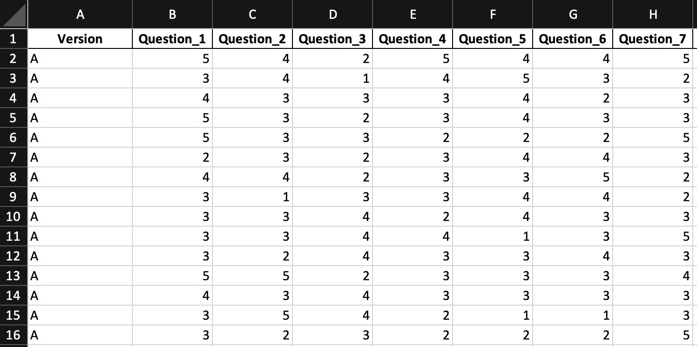
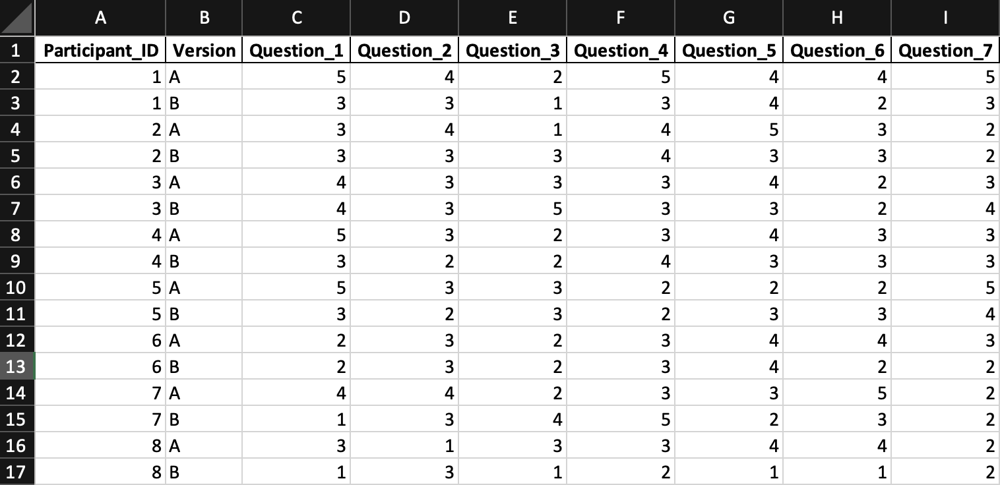

```{r setup, include=FALSE}
knitr::opts_chunk$set(echo = TRUE)
library(tidyverse)
library(tinytex)
tinytex::install_tinytex(force = TRUE)
?rmarkdown::pandoc_available
```
### Likert Scales

In the realm of UI/UX research, Likert scales play a pivotal role in quantitatively capturing opinions, attitudes, and responses to various questions. These scales, typically ranging from "strongly disagree" to "strongly agree," offer a simple yet powerful way for respondents to express their level of agreement with a given statement. The versatility of Likert scales makes them a staple in HCI.

For a list of Likert scale examples, see [here](https://www.extension.iastate.edu/documents/anr/likertscaleexamplesforsurveys.pdf).

> **BEFORE YOU BEGIN**\
> This guide uses R to read the data from an Excel file, generate plots, summary statistics, and conduct the analysis. Please install an IDE that supports R programming, such as [RStudio](https://posit.co/downloads/) or [PyCharm](https://www.jetbrains.com/pycharm/) with the [R plugin](https://plugins.jetbrains.com/plugin/6632-r-language-for-intellij).

### Step 1: Preparing Data

At this point, you should have a set of survey responses to one or more Likert scale questions.

The responses should be stored in an Excel file, with each row representing a respondent. Each question gets its own column, though how the design prototype is incorporated is dependent on whether you ran a between or within-subjects design experiment.

> **Experimental Design**\
> * If you ran a **between-subjects** design, you only need a column for the prototype version.\
> * If you ran a **within-subjects** design, you should have one column for the prototype version and another column for a user's identifier (e.g., participant ID).\
> \
> In either case, the remainder of your columns should correspond to each Likert scale question.

This is an example of what your Excel file should look like for a **between-subjects** design:



And for a **within-subjects** design:



### Step 2: Loading Data into R

Now that you have your data in an Excel file, you can load it into R. The easiest way to do this is to use the `read_excel()` function from the `readxl` package.

If you haven't installed the package yet, be sure to uncomment the `install.packages()` line in the code chunk below.

```{r read, echo=TRUE}
# install.packages("readxl")
library(readxl)

likert_data_multiple_ws <- read_excel("usability_study_likert_within_subjects_data.xlsx")
```

### Step 3: Creating Plots

It may be useful to create some bar graphs to show the distribution of Likert scores by version and by question.

```{r plots, echo=TRUE}
# install.packages("ggplot2")
# install.packages("dplyr")
library(ggplot2)
library(tidyr)

# Reshape the data to long format
data_long <- pivot_longer(likert_data_multiple_ws,
                          cols = starts_with("Question"),
                          names_to = "Question",
                          values_to = "Likert_Rating")

# Function to create a bar chart for a given question
plot_question_versions <- function(question) {
  filtered_data <- filter(data_long, Question == question)

  ggplot(filtered_data, aes(x = as.factor(Likert_Rating), fill = Version)) +
    geom_bar(position = position_dodge()) +
    scale_fill_brewer(palette = "Set1", name = "Version") +
    labs(title = paste("Bar Chart for", question),
         x = "Likert Rating",
         y = "Frequency") +
    theme(plot.title = element_text(hjust = 0.5, face = "bold"))
}

# Get unique questions
unique_questions <- unique(data_long$Question)
print(plot_question_versions(unique_questions[1]))
```

If you want to get an individual plot for each question, you can use a for loop to iterate through each question and call the `plot_question_versions()` function.

``` {r plots2, eval=FALSE}
# Loop through each question and plot
for (question in unique_questions) {
  print(plot_question_versions(question))
}
```

### Step 4: Creating Summary Statistics

You can also create summary statistics for each question and each version, such as the mean, median, standard deviation, minimum, and maximum.

``` {r summary_statistics, echo=TRUE}
# Compute summary statistics for each version and question
summary_stats_likert_multiple <- data_long %>%
  group_by(Question, Version) %>%
  summarize(
    Count = n(),
    Mean = mean(Likert_Rating),
    Median = median(Likert_Rating),
    Standard_Deviation = sd(Likert_Rating),
    Min = min(Likert_Rating),
    Max = max(Likert_Rating)
  )

# Print the summary statistics
options(dplyr.print_max = Inf)
print(summary_stats_likert_multiple)
```
### Step 5: Running Statistical Tests

The statistical test you run depends on the experimental design you used. For within-subjects design, you should use the Wilcoxon signed rank test. For between-subjects design, you should use the Wilcoxon rank sum test.

The Wilcoxon signed ranked test is a non-parametric test that compares two related samples. The Wilcoxon rank sum test (a.k.a. the Mean-Whitney U test) is a non-parametric test that compares two independent samples. These tests are non-parametric tests--used when the data is not normally distributed or when the sample size is small. Such is the case with Likert scale data.

**Within-subjects:**
```{r statistical_tests, echo=TRUE}
# Initializing a dataframe to store the results
test_results <- data.frame(Question = character(),
                           Wilcoxon_Statistic = numeric(),
                           P_Value = numeric(),
                           stringsAsFactors = FALSE)

data_wide <- data_long %>%
  pivot_wider(names_from = Version, values_from = Likert_Rating)

# Looping through each question to perform the test
for (q in unique(data_long$Question)) {
  # Extracting the paired responses for each version
  responses <- filter(data_wide, Question == q)

  # Performing the Wilcoxon signed-rank test
  test <- wilcox.test(responses$`A`, responses$`B`, paired = TRUE)

  # Storing the results
  test_results <- rbind(test_results,
                        data.frame(Question = q,
                                   Wilcoxon_Statistic = test$statistic,
                                   P_Value = test$p.value))
}

# Displaying the test results
print(test_results)
```

For a **between-subjects** design, you can use the Wilcoxon rank sum test. See the GitHub page for more information.